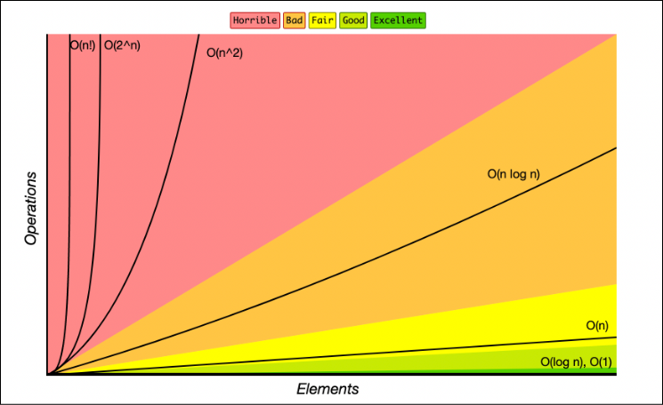

# Unit 9 Notes: Big O Notation

The processing complexity of various sorting algorithms and operations in different data structures

Big O Notation expresses an upper bound on the time complexity for an algorithm

#### Time Complexity Chart

| Best           | Good | Fair       | Bad      | Terrible | Worst |
| -------------- | ---- | ---------- | -------- | -------- | ----- |
| O(1), O(log n) | O(n) | O(n log n) | O($n^2$) | O($2^n$) | O(n!) |

## Time Complexities for Algorithms

### Insertion Sort

- Best case: O(n)
- Worst case: O($n^2$)

### Quick Sort

- Best case: O(n log n)
- Worst case: O($n^2$)

### Bubble Sort

- Best case: O($n^2$)

### Merge Sort

- Best case: O(n log2 n)
- Worst case: O(n log2 n)

## Time Complexities for Data Structures Operations

### Arrays

- Adding to front: O(n)
- Adding to middle O(n)
- Adding to end: O(1)
- Deleting item: O(n)

### Linked Lists

- Adding to front: O(1)
- Deleting item (known location): O(1)

### Tree Sets (Balanced)

- Adding an item: O(log2n)
- Searching an item: O(log2n)
- Travsersing: O(n)

### Hash Sets

- Adding an item: O(1)

### Binary Search Trees

- Adding to the tree: O(log2n)
- Searching in the tree: O(log2n)
- Travsersing in the tree: O(n)
